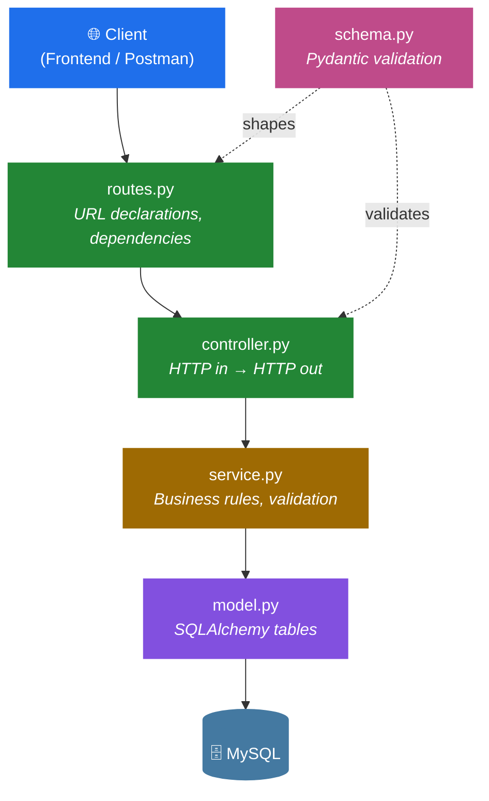
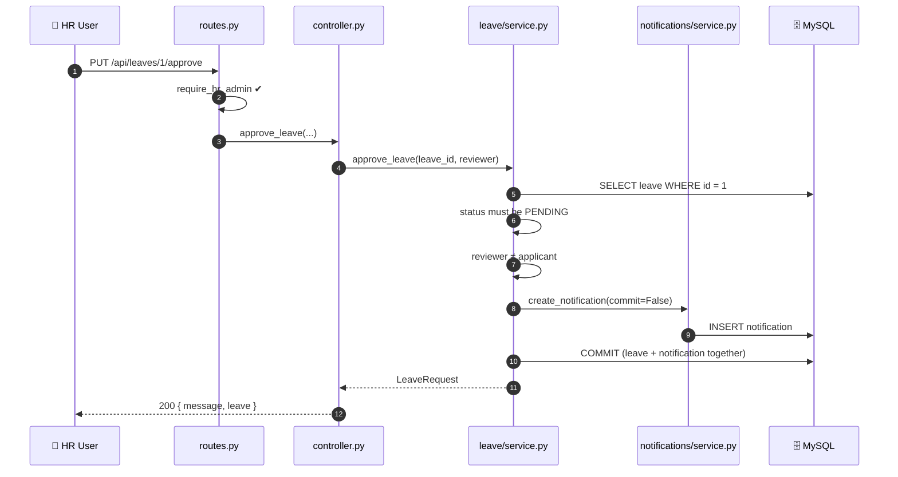
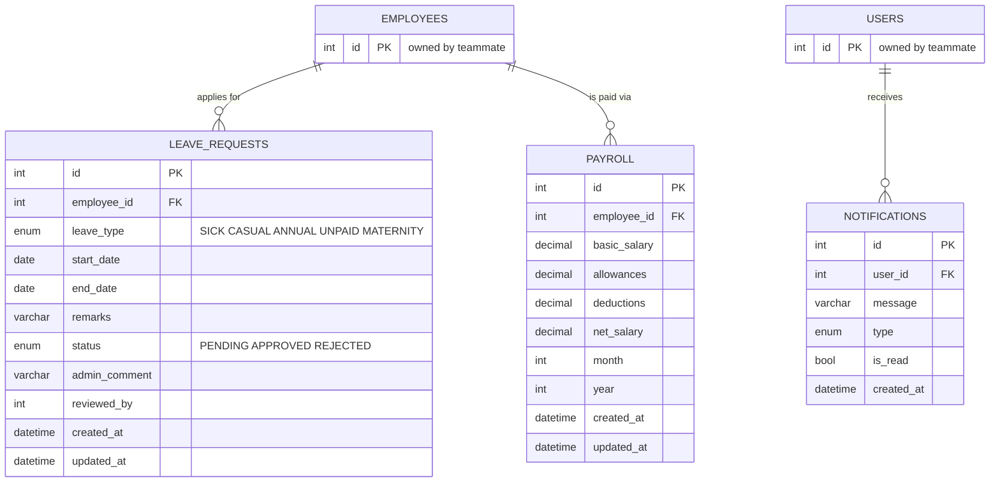

<div align="center">

# 🗓️ Dayflow

### Human Resource Management System — Backend

*Leave · Payroll · Notifications · Reports*

[](https://www.python.org/)
[](https://fastapi.tiangolo.com/)
[](https://www.sqlalchemy.org/)
[](https://www.mysql.com/)
[](https://docs.pydantic.dev/)

**18 endpoints** · **4 modules** · **3 tables** · **38 passing checks**

</div>

---

## 📖 Table of Contents

- [Overview](#-overview)
- [Architecture](#-architecture)
- [Request Lifecycle](#-request-lifecycle)
- [Data Model](#-data-model)
- [Project Structure](#-project-structure)
- [Getting Started](#-getting-started)
- [API Reference](#-api-reference)
- [Authentication](#-authentication)
- [Business Rules](#-business-rules)
- [Engineering Notes](#-engineering-notes)
- [Testing](#-testing)
- [Roadmap](#-roadmap)
- [Troubleshooting](#-troubleshooting)

---

## 🎯 Overview

Dayflow replaces scattered, manual HR processes with a single centralised system.
This service is the backend for four of its domains:

| Module | Responsibility |
|:--|:--|
| 🏖️ **Leave** | Applications, approvals, rejections, overlap detection |
| 💰 **Payroll** | Salary records, net-pay calculation, role-gated updates |
| 🔔 **Notifications** | Event fan-out, reusable by any module |
| 📊 **Reports** | Read-only aggregation and analytics for HR/Admin |

Built with a strict layered architecture: **every** request flows through the same
five files, and business rules live in exactly one place.

> **Scope note** — Authentication, Employee and Attendance are owned by a
> teammate. This service *integrates* with them; it never duplicates them.

---

## 🏗 Architecture



**Layer contract**

| Layer | Knows about HTTP? | Knows about SQL? | Holds business rules? |
|:--|:-:|:-:|:-:|
| `routes.py` | ✅ | ❌ | ❌ |
| `controller.py` | ✅ | ❌ | ❌ |
| `service.py` | ❌ | ✅ | ✅ |
| `model.py` | ❌ | ✅ | ❌ |
| `schema.py` | ❌ | ❌ | shape only |

Services raise plain Python errors (`NotFoundError`, `ConflictError`, …). A single
handler in `main.py` maps them to status codes — which is why **no controller
contains a `try/except` block**.

---

## 🔄 Request Lifecycle

Leave approval, end to end — including the cross-module notification:



The `commit=False` handoff is deliberate: the leave update and its notification
share **one transaction**. Either both land, or neither does.

---

## 🗃 Data Model



`PAYROLL` carries a `UNIQUE(employee_id, month, year)` constraint — one payslip
per employee per period, enforced by the database rather than by hope.

---

## 📁 Project Structure

```
backend/
├── .env                        # secrets — git-ignored, never committed
├── .env.example                # template for teammates
├── requirements.txt
└── app/
    ├── main.py                 # app factory, CORS, exception handlers, routers
    ├── dependencies.py         # 🔌 auth integration point (see below)
    ├── exceptions.py           # shared service-layer error types
    ├── database/
    │   └── connection.py       # engine · SessionLocal · Base · get_db
    └── modules/
        ├── leave/              # routes · controller · service · model · schema
        ├── payroll/            #   ⋮
        ├── notifications/      #   ⋮
        └── reports/            #   ⋮  (no tables — aggregation only)
```

Every module is identical in shape. Learn one, and you know all four.

---

## 🚀 Getting Started

### Prerequisites

- Python **3.13+**
- MySQL **8.0+**

### 1 · Install

```bash
cd backend
python3 -m venv venv
source venv/bin/activate          # Windows: venv\Scripts\activate
pip install -r requirements.txt
```

### 2 · Configure

```bash
cp .env.example .env
```

```ini
DB_HOST=127.0.0.1
DB_PORT=3306
DB_NAME=dayflow
DB_USER=root
DB_PASSWORD=your_password_here
```

> `.env` is git-ignored. No credential ever appears in a `.py` file.

### 3 · Create the database

Run this **inside MySQL** (not your shell):

```sql
CREATE DATABASE dayflow CHARACTER SET utf8mb4 COLLATE utf8mb4_unicode_ci;
```

### 4 · Run

```bash
uvicorn app.main:app --reload
```

Tables are created automatically at startup.

| | |
|:--|:--|
| 📘 **Swagger UI** | http://127.0.0.1:8000/docs |
| 📗 **ReDoc** | http://127.0.0.1:8000/redoc |
| ❤️ **Health** | http://127.0.0.1:8000/health |

---

## 🔌 API Reference

<details open>
<summary><b>🏖️ Leave</b> — 6 endpoints</summary>

| Method | Endpoint | Access | Description |
|:--|:--|:--|:--|
| `POST` | `/api/leaves` | Any | Apply for leave → `PENDING` |
| `GET` | `/api/leaves/my` | Any | Your own requests |
| `GET` | `/api/leaves` | HR · Admin | All requests, filterable |
| `GET` | `/api/leaves/{id}` | Owner · HR · Admin | Single request |
| `PUT` | `/api/leaves/{id}/approve` | HR · Admin | Approve a pending request |
| `PUT` | `/api/leaves/{id}/reject` | HR · Admin | Reject — reason required |

</details>

<details open>
<summary><b>💰 Payroll</b> — 4 endpoints</summary>

| Method | Endpoint | Access | Description |
|:--|:--|:--|:--|
| `GET` | `/api/payroll/my` | Any | Your own payslips |
| `GET` | `/api/payroll` | HR · Admin | All payroll records |
| `GET` | `/api/payroll/{employee_id}` | Owner · HR · Admin | One employee's history |
| `PUT` | `/api/payroll/{employee_id}` | HR · Admin | Create or update a period |

</details>

<details open>
<summary><b>🔔 Notifications</b> — 3 endpoints</summary>

| Method | Endpoint | Access | Description |
|:--|:--|:--|:--|
| `GET` | `/api/notifications` | Any | Your notifications |
| `GET` | `/api/notifications/unread-count` | Any | Badge counter |
| `PUT` | `/api/notifications/{id}/read` | Owner | Mark as read |

</details>

<details open>
<summary><b>📊 Reports</b> — 4 endpoints · HR · Admin only</summary>

| Method | Endpoint | Description |
|:--|:--|:--|
| `GET` | `/api/reports/leave` | Status counts, by type, approval rate, days taken |
| `GET` | `/api/reports/payroll` | Totals, average, spread, per-period breakdown |
| `GET` | `/api/reports/employees` | Employee counts |
| `GET` | `/api/reports/attendance` | ⏳ `503` until the attendance module lands |

</details>

### Example

```bash
curl -X POST http://127.0.0.1:8000/api/leaves \
  -H 'Content-Type: application/json' \
  -H 'X-User-Id: 5' -H 'X-Employee-Id: 5' -H 'X-Role: EMPLOYEE' \
  -d '{
        "leave_type": "CASUAL",
        "start_date": "2026-09-01",
        "end_date":   "2026-09-03",
        "remarks":    "Family function"
      }'
```

```jsonc
// 201 Created
{
  "message": "Leave request submitted.",
  "leave": {
    "id": 1,
    "employee_id": 5,
    "leave_type": "CASUAL",
    "start_date": "2026-09-01",
    "end_date": "2026-09-03",
    "status": "PENDING",
    "total_days": 3          // computed, not stored
  }
}
```

### Status Codes

| Code | Meaning |
|:--|:--|
| `200` · `201` | Success · Created |
| `400` | Business rule violated (bad dates, deductions exceed pay) |
| `401` | Not authenticated |
| `403` | Authenticated, but not permitted |
| `404` | Not found — *also returned instead of 403 where existence itself is private* |
| `409` | Conflict (overlapping leave, already-decided request, duplicate period) |
| `422` | Payload failed schema validation |
| `503` | Depends on a module not yet integrated |

---

## 🔐 Authentication

> [!WARNING]
> **Development shim in place.** JWT authentication is owned by a teammate and
> not yet merged. Until then, `app/dependencies.py` derives the caller from
> headers. This is **insecure** and must not ship.

```http
X-User-Id: 5
X-Employee-Id: 5
X-Role: EMPLOYEE          # EMPLOYEE | HR | ADMIN
```

**Migration path** — replace the body of `get_current_user()` with the real JWT
dependency. Provided the returned object exposes `.id`, `.employee_id` and
`.role`, **no other file changes**. All four modules import from this one place.

### Authorisation Matrix

| Action | Employee | HR | Admin |
|:--|:-:|:-:|:-:|
| Apply for leave | ✅ | ✅ | ✅ |
| View own leave / payroll | ✅ | ✅ | ✅ |
| View **anyone's** leave / payroll | ❌ | ✅ | ✅ |
| Approve · reject leave | ❌ | ✅ | ✅ |
| Update payroll | ❌ | ✅ | ✅ |
| Update **own** payroll | ❌ | ❌ | ❌ |
| View reports | ❌ | ✅ | ✅ |

Enforced server-side at both the route and service layers. Hiding a button in the
frontend is not access control.

---

## 📐 Business Rules

<details open>
<summary><b>Leave</b></summary>

- `start_date` ≤ `end_date`
- No start date in the past
- Maximum **90** consecutive days
- **No overlap** with existing `PENDING` or `APPROVED` requests — a `REJECTED`
  request never blocks re-application
- Adjacent ranges are permitted (Sep 1–3 then Sep 4–5 ✅)
- Only `PENDING` requests can be decided; double-approval → `409`
- Rejection **requires** a written reason
- Nobody may approve their own request
- `total_days` is inclusive: Sep 1 → Sep 3 = **3 days**

</details>

<details open>
<summary><b>Payroll</b></summary>

```
net_salary = basic_salary + allowances − deductions
```

- Computed **server-side** and stored, so a historic payslip never drifts
- `net_salary` is never accepted from the client
- Negative results rejected
- All money stored as `DECIMAL(12,2)` — never floating point
- One record per employee per month, enforced by a unique constraint

</details>

---

## 🧠 Engineering Notes

Decisions worth knowing before you change anything.

| Decision | Rationale |
|:--|:--|
| **`DECIMAL`, not `FLOAT`** | `0.1 + 0.2 ≠ 0.3`. Unacceptable for salaries. |
| **Errors raised, not returned** | Services stay HTTP-agnostic; one handler maps them centrally. |
| **`commit=False` fan-out** | Cross-module writes share a transaction — no orphaned notifications. |
| **Identity from the token, never the body** | `LeaveCreate` has no `employee_id` or `status` field, so neither can be spoofed. |
| **Retry on `IntegrityError`** | Check-then-insert is not atomic; concurrent writes now resolve to an update instead of a `500`. |
| **404 over 403 for other users' rows** | Confirming a record exists is itself a leak. |
| **Static routes before dynamic** | `/api/leaves/my` must precede `/api/leaves/{id}`. |
| **Reports own no tables** | Duplicated data drifts. Reports read and aggregate only. |
| **Indexed `status` + `employee_id`** | The two hottest filters in the product. |

---

## 🧪 Testing

38 automated checks cover the happy paths, every boundary, and the full
authorisation matrix.

```bash
uvicorn app.main:app --reload      # terminal 1
python3 regression.py              # terminal 2
```

<details>
<summary>What's covered</summary>

**Boundaries** — leave starting today ✅ / yesterday ❌ · exactly 90 days ✅ /
91 ❌ · adjacent dates ✅ / same-day clash ❌ · re-apply after rejection ✅ ·
net salary of zero ✅ / negative ❌ · empty-database reports return zeros
rather than dividing by zero

**Authorisation** — employee blocked from setting their own salary, from HR-only
listings, from other users' leave, payroll and notifications; HR blocked from
editing their own payroll

**Concurrency** — six simultaneous writes to the same payroll period resolve to
one row, zero `500`s

</details>

---

## 🗺 Roadmap

| | Milestone |
|:-:|:--|
| ✅ | Project setup · database connection |
| ✅ | Leave module |
| ✅ | Approvals · rejections · comments |
| ✅ | Notifications |
| ✅ | Payroll |
| ✅ | Reports |
| ✅ | Verified against MySQL 8 |
| ⬜ | Swap the auth shim for real JWT |
| ⬜ | Promote `employee_id` / `user_id` to foreign keys |
| ⬜ | Attendance reporting |
| ⬜ | Alembic migrations |
| ⬜ | Frontend integration |

### Integration Checklist

Every touchpoint is tagged `INTEGRATION POINT` or `TODO` in the source:

| File | Needs |
|:--|:--|
| `app/dependencies.py` | Real `get_current_user` |
| `leave/model.py` · `payroll/model.py` | Employee table name → FK |
| `notifications/model.py` | User table name → FK |
| `leave/service.py` | `employee_id → user_id` mapping · HR recipient lookup |
| `reports/service.py` | Attendance model · department statistics |

---

## 🛠 Troubleshooting

<details>
<summary><b>Common issues</b></summary>

| Symptom | Cause & Fix |
|:--|:--|
| `404` on `/` | Expected — there is no root route. Use `/docs`. |
| `ModuleNotFoundError: No module named 'app'` | Run `uvicorn` from `backend/`, not `backend/app/`. |
| `401 Missing X-User-Id / X-Role` | Dev auth headers absent. |
| `403 You do not have permission` | Working as designed — send `X-Role: HR`. |
| `Access denied for user 'root'` | Wrong `DB_PASSWORD` in `.env`. |
| `Unknown database 'dayflow'` | `CREATE DATABASE` step skipped. |
| `No module named 'MySQLdb'` | The `+pymysql` driver suffix was dropped from the URL. |
| `cryptography is required` | MySQL 8 default auth — already pinned in `requirements.txt`. |
| Model changed, column missing | `create_all()` never *alters* a table. Drop it and restart, or adopt Alembic. |

</details>

---

<div align="center">

**Dayflow HRMS** · Backend Service

Built with FastAPI · SQLAlchemy · MySQL

</div>
